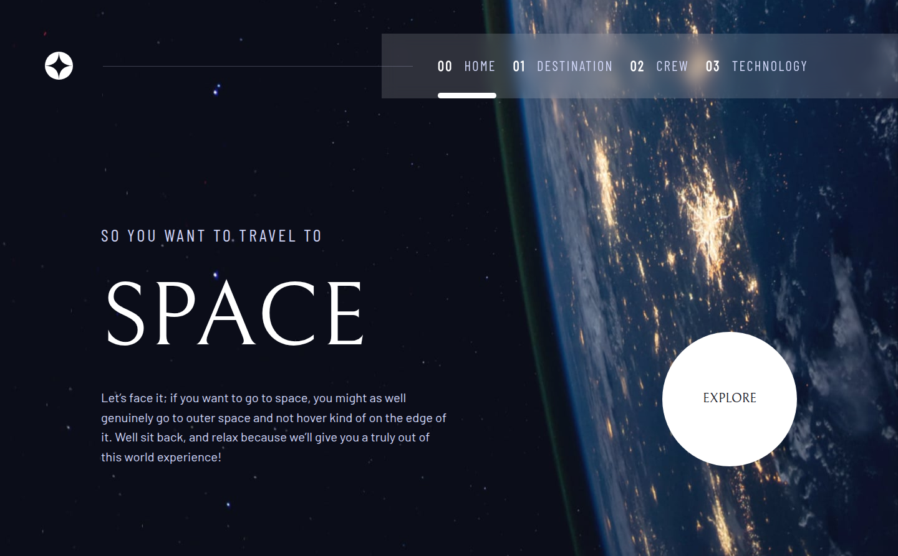

# Frontend Mentor - Space tourism website solution

This is a solution to the [Space tourism website challenge on Frontend Mentor](https://www.frontendmentor.io/challenges/space-tourism-multipage-website-gRWj1URZ3). Frontend Mentor challenges help you improve your coding skills by building realistic projects. 

## Table of contents

- [Overview](#overview)
  - [The challenge](#the-challenge)
  - [Screenshot](#screenshot)
  - [Links](#links)
- [My process](#my-process)
  - [Built with](#built-with)
  - [What I learned](#what-i-learned)
- [Author](#author)

## Overview

### The challenge

Users should be able to:

- View the optimal layout for each of the website's pages depending on their device's screen size
- See hover states for all interactive elements on the page
- View each page and be able to toggle between the tabs to see new information

### Screenshot



### Links

- Solution URL: [View Solution](https://github.com/muhammadarhamrafiq/space-tourism)
- Live Site URL: [Visit Live](https://muhammadarhamrafiq.github.io/space-tourism)

## My process

### Built with

- Semantic HTML5 markup
- CSS custom properties
- Flexbox
- CSS Grid
- Mobile-first workflow
- Tailwind CSS

### What I learned

In this project I specifically focus on the accessibility and focus controlls. I added the focus traping in the side menus and also wrote the clean resualbe componenet controller Tab due to which I was able to controll multiple tabs in my site without repeating the controller logics. This class independently controlls the two types of tabs on my site along with their acessibility.

To see how you can add code snippets, see below:
```js
class SplittedTabController {
  constructor(tabs, tabPannels, stagged) {
    this.tabs = tabs;
    this.tabPannels = tabPannels;
    this.stagged = stagged || false;
    this.current = 0;

    this.init();
  }

  init() {
    this.tabs.forEach((tab, index) => {
      this.focusHandling(tab, index);
      this.handleClick(tab, index);
    });
  }

  focusHandling(tab, index) {
    tab.addEventListener("keydown", (event) => {
      if (event.key == "ArrowRight") {
        const nextTab = (index + 1) % this.tabs.length;
        this.tabs[nextTab].focus();
      } else if (event.key == "ArrowLeft") {
        const prevTab = (index - 1 + this.tabs.length) % this.tabs.length;
        this.tabs[prevTab].focus();
      }
    });
  }

  handleClick(tab, index) {
    tab.addEventListener("click", () => {
      if (index === this.current) return; // for saving the jump back transition
      this.activateTab(index);
      if (this.stagged) {
        this.staggedActivation(index);
      } else {
        this.activatePannels(index);
      }
      this.current = index;
    });
  }

  activateTab(index) {
    const newTab = this.tabs[index];
    const currentTab = this.tabs[this.current];

    currentTab.setAttribute("aria-selected", "false");
    currentTab.setAttribute("tabindex", "-1");
    currentTab.setAttribute("data-active", "false");

    newTab.setAttribute("aria-selected", "true");
    newTab.setAttribute("tabindex", "0");
    newTab.setAttribute("data-active", "true");
  }

  activatePannels(index) {
    const newPannel = this.tabPannels[index];
    const currentPannel = this.tabPannels[this.current];

    for (let subPanel in currentPannel) {
      currentPannel[subPanel].setAttribute("aria-hidden", "true");
      currentPannel[subPanel].setAttribute("data-active", "false");

      currentPannel[subPanel].setAttribute("data-outgoing", true);
      currentPannel[subPanel].addEventListener(
        "transitionend",
        () => {
          currentPannel[subPanel].setAttribute("data-outgoing", "false");
        },
        { once: true }
      );
    }

    for (let subPanel in newPannel) {
      newPannel[subPanel].setAttribute("data-active", "true");
      newPannel[subPanel].setAttribute("aria-hidden", "false");
    }
  }

  staggedActivation(index) {
    const newPannel = this.tabPannels[index];
    const currentPannel = this.tabPannels[this.current];

    for (let subPanel in currentPannel) {
      currentPannel[subPanel].setAttribute("aria-hidden", "true");
      currentPannel[subPanel].setAttribute("data-active", "false");
      currentPannel[subPanel].addEventListener("transitionend", () => {
        console.log("Runned");
        for (let nsubPanel in newPannel) {
          newPannel[nsubPanel].setAttribute("data-active", "true");
          newPannel[nsubPanel].setAttribute("aria-hidden", "false");
        }
      }, {once: true});
    }
  }
}


```

## Author

- Website - [Muhammad Arham](https://muhammadarhamrafiq.github.io/Portfolio)
- Frontend Mentor - [@fa23bcs233](https://www.frontendmentor.io/profile/fa23bcs233)
- Twitter - [@arhamrafiq831](https://www.twitter.com/arhamrafiq831)
- LinkedIn - [Muhammad Arham Rafiq]("www.linkedin.com/in/muhammad-arham-rafiq")